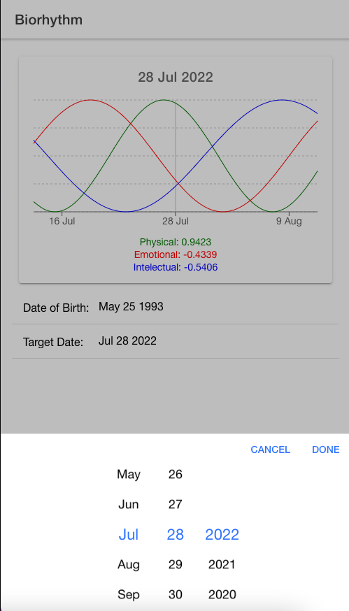

#######################################################################################
############################ EXTRA INFORMATION ABOUT IONIC ############################
#######################################################################################

# Ionic-React-Model

## Links

- [Ionic Documentation Home](https://ionicframework.com/docs)
- [UI Components](https://ionicframework.com/docs/components)
- [IonButton](https://ionicframework.com/docs/api/button)
- [IonToast](https://ionicframework.com/docs/api/toast)
- [Ionicons](https://ionicons.com/)
- [Theme Colors](https://ionicframework.com/docs/theming/basics#colors)
- [Layered Colors](https://ionicframework.com/docs/theming/colors#layered-colors)
- [Color Generator](https://ionicframework.com/docs/theming/color-generator)
- [CSS Variables](https://ionicframework.com/docs/theming/css-variables)
- [CSS Utilities](https://ionicframework.com/docs/layout/css-utilities)

Ionic framework with React

## Setup

Link: https://ionicframework.com/docs/intro/cli

> npm install -g @ionic/cli

> ionic start proj-name blank

- To start the applicatio:
  > ionic serve

* ionic start
* project name
* configuration: tabs, brank or side menu

## CORDOVA

Link: https://cordova.apache.org/

## CAPACITOR

Link: https://capacitorjs.com/

> npm install @capacitor/core@2.4.7 --save-exact

> npm install @capacitor/cli@2.4.7 --save-exact --save-dev

> ionic integrations enable capacitor

> ionic build

- To initialize Capacitor:

> npx cap init --web-dir build --npm-client npm Biorhythms org.example.biorhythms

### HOW TO UPDATE THE PROJECT IN ANDROID STUDIO

- After changes, you need to run:

> npm run build => To update the production folder

> npx cap sync android => To sync build folder with the android project

### Install Cocoapods

Link: https://guides.cocoapods.org/using/getting-started.html#installation

> sudo gem install cocoapods

### Install IOS

> npx cap add ios

- To open the App in a Xcode
  > npx cap open ios

### Install Android

> npx cap add android

- To open App in Android Emulator

  > npx cap open android

# Biorhythm Calculator

This example is part of the Ionic React course.

## Links

- [Biorhythm](https://en.wikipedia.org/wiki/Biorhythm) Wikipedia entry
- [Biorhythm Calculator](https://keisan.casio.com/exec/system/1340246447) by Casio

## Date js

link: https://day.js.org/

## Recharts js

Link: https://recharts.org/en-US/

## PUBLISHING THE BIORHYTHM

- Create a Build folder

> npm run build

> npx serve -s build

- You will receive an url for ex.
  Local: http://localhost:3000  
  On Your Network: http://192.168.0.102:3000

* Now you have a Build forlder with your production App

### Deploy the App in Netlify

Link: https://app.netlify.com/

Site: https://paulo-biorhythm.netlify.app/

## Sync Visual Code with IOS emulator

1 - Install Capacitor
2 - In file capacitor.config.json add this code after cordova:

> "server": {
> "url": "http://192.168.0.102:3000"
> }

> npx cap open ios

## CHANGE THE ICONS AND SPLASH IMAGES => Capacitor Assets (formerly cordova-res)

<ul>
  <li>Create a folde named resources</li>
  <li>Insert there the new Icon and Splash image</li>
  <li>Run this commands:</li>
  <li>$ npx cordova-res android --skip-config --copy</li>
  <li>$ npx cordova-res ios --skip-config --copy</li>
  <li>We don´t need to sync, it happens automatic</li>
</ul>
